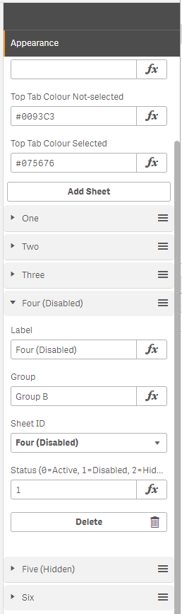

# Qlik-Sense-Tab-Buttons
Tab Button Navigation Extension for Qlik Sense

A tab and sub-tab bar to improve navigation between sheets. Sub tab grouping helps organise sheets when there are a lot of them. 

## Example (above):
* Sheet 1 is Group A and Active
* Sheet 2 is Group A and Active
* Sheet 3 is Group B and Active
* Sheet 4 is Group B and Inactive
* Sheet 5 is Group B and Disabled
* Sheet 6 is Group B and Active

## Installation
- Copy all the files to "Qlik\Sense\Extensions\Tab Buttons"
- Refresh Qlik Sense browser

## Configuration
- The extension is called "Tab Buttons". It needs at least 1 row height (under standard grid sizing) and wide enough for the tab buttons to show
* Title is optional
* Top Tab Colour Selected defaults to the colour shown on "Group A"
* Top Tab Colour Selected defaults to the colour shown on "Group B"
* Add a Sheet
    * Label is the sub tab label
    * Group is the top tab label
    * Sheet ID includes a dropdown to select the sheet. If a new sheet is added, the browser should be refreshed
    * Status can be set by and expression
        * 0 = Active
        * 1 = Inactive (greyed out but visible)
        * 2 = Disabled (Hidden)

## Suggested Improvements

Please feel free to contribute to the project. 
- Make it responsive. The extension is not currently designed to fit a mobile screen. 
- Option to show Sub Tabs as drop down menus rather than a separate row.
